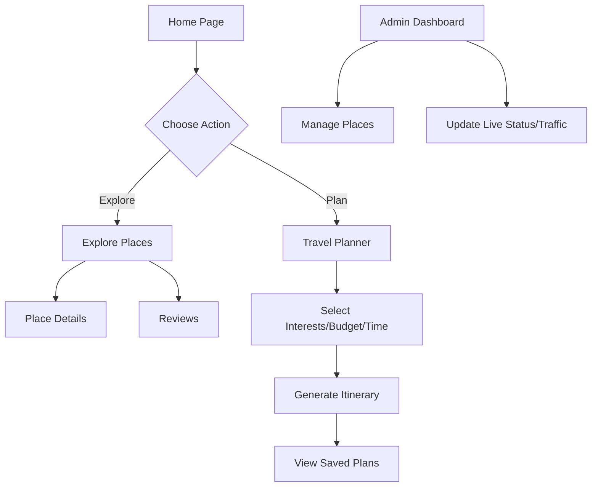

# Saarthi - Your Smart Travel Companion

Saarthi is a modern Next.js web application designed to help users plan trips, explore places, and manage their travel itineraries seamlessly.

## Application Flow



## Getting Started

First, run the development server:

```bash
npm run dev
# or
yarn dev
# or
pnpm dev
# or
bun dev
```

Open [http://localhost:3000](http://localhost:3000) with your browser to see the result.
