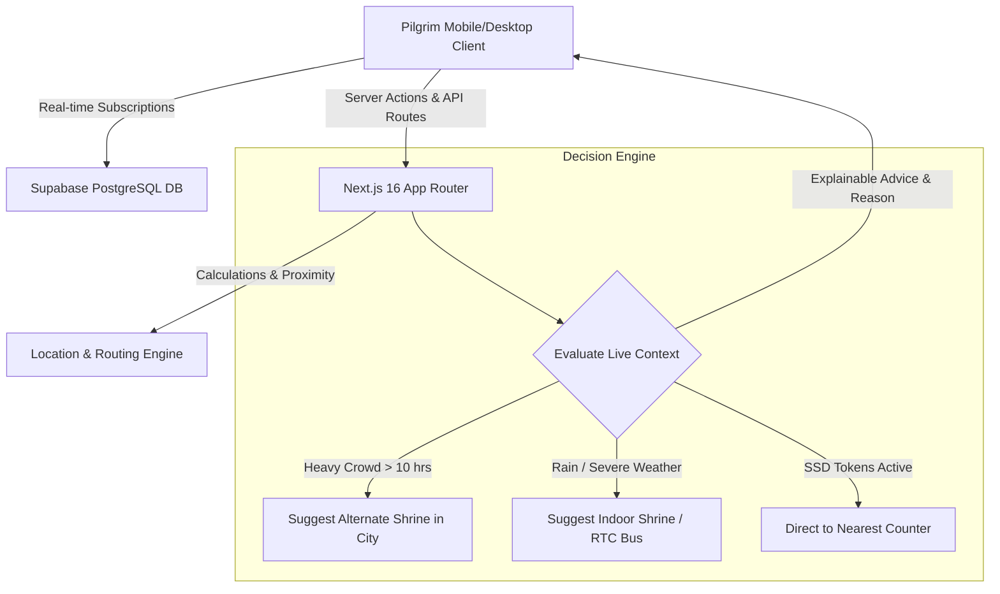

# 🪔 Saarthi (సారథి)
### *Your Real-Time Pilgrim Companion for Tirupati & Tirumala*

[](https://nextjs.org/)
[](https://www.typescriptlang.org/)
[](https://supabase.com/)
[](https://github.com/saarthitirupati/saarthiguide1)
[](LICENSE)

<br/>

> **Saarthi** is an intelligent, real-time pilgrim guidance platform designed to eliminate unpredictable queue delays, reduce travel anxiety, and provide transparent, data-driven recommendations for millions of devotees visiting Tirumala & Tirupati.

---

</div>

<br/>

## ⚡ Key Highlights & Features

| Feature | Description | Impact |
| :--- | :--- | :--- |
| **🤖 Saarthi Decision Engine** | Evaluates weather, live queue wait times, and token quotas to suggest the optimal next step. | Saves up to **8+ hours** in peak queues |
| **🗺️ Interactive 9.5/10 Journey Map** | Live topographic map showing Ghat Road route, Alipiri Checkpost, SSD Counters & Tirumala Temple with real-time status. | Clear situational awareness |
| **🎫 Live SSD Token Monitor** | Real-time tracking of offline Slotted Sarva Darshan tokens across Vishnu Nivasam, Srinivasam & Bhudevi complexes via Supabase. | Prevents wasted trips when quotas fill |
| **📍 Dynamic GPS & Region Selector** | Hardware GPS auto-detection to dynamically identify whether pilgrim is at Tirumala Hill or Tirupati City. | Location-aware guidance |
| **📱 Full Responsive Layout System** | Multi-breakpoint design (Mobile <768px carousels, Tablet 2-col, Small Desktop 3-col, Desktop 4-col with Sticky Filter Sidebar). | Seamless across all screens |
| **🚨 Real-Time Admin Alerts** | Supabase PostgreSQL WebSockets for instant broadcast of rain alerts, route closures, and queue advisories. | Real-time pilgrim safety |
| **🔒 Saarthi Admin Suite (`/saarthiadmin`)** | Production-ready admin panel connected directly to Supabase `live_alerts` & `live_metrics` tables. | Instant operational control |

---

## 🏗️ System Architecture



---

## 📱 Mobile & Desktop Responsive Layout Blueprint

- **Mobile (`<768px`)**: Single column container with horizontal scrolling place carousels.
- **Tablet (`768px–1023px`)**: 2-column grid layout for places & categories.
- **Small Desktop (`1024px–1279px`)**: 3-column place grids with expanded 720px search bar.
- **Desktop (`1280px+`)**: Sticky Left Filter Sidebar (Categories, Distance, Open Now) + 3/4-column place grid.

---

## 🛠️ Technology Stack

### **Frontend & Framework**
- **Framework**: [Next.js 16](https://nextjs.org/) (App Router, Turbopack)
- **Language**: [TypeScript](https://www.typescriptlang.org/)
- **Styling**: Vanilla CSS Modules (Design tokens, modern glassmorphism, responsive grid system)
- **Icons**: [Lucide React](https://lucide.dev/)

### **Backend & Realtime**
- **Database & WebSockets**: [Supabase](https://supabase.com/) (PostgreSQL `live_alerts`, `live_metrics`, `places`)
- **Location Engine**: Hardware GPS Geolocation API + Haversine & OSRM road distance routing

---

## 🚀 Quick Start Guide

### Prerequisites
- **Node.js** >= 18.x
- **npm** or **pnpm**

### 1. Clone the Repository
```bash
git clone https://github.com/saarthitirupati/saarthiguide1.git
cd saarthiguide1
```

### 2. Install & Start Web App
```bash
npm install
npm run dev
```

Open `http://localhost:3000` in your browser to launch Saarthi!

---

## 📂 Project Structure

```
saarthi/
├── src/
│   ├── app/
│   │   ├── explore/          # Responsive 2-column discovery page with sidebar
│   │   ├── saarthiadmin/     # Real-time admin control panel
│   │   ├── page.tsx          # Home dashboard & decision engine
│   │   └── layout.tsx        # Root layout & meta configuration
│   ├── components/
│   │   ├── home/             # HomeHero, RecommendationCard, DailyContent, JourneyOverviewPanel
│   │   ├── DesktopHeader.tsx # Desktop top bar & dynamic region selector
│   │   └── Logo/             # Brand logo lockup
│   └── lib/
│       ├── location.ts       # Hardware GPS & IP location pipeline
│       ├── statusDb.ts       # Supabase live metrics upsert helper
│       └── supabase.ts       # Supabase client
└── README.md
```

---

## 🤝 Contributing

Contributions are welcome! Please feel free to submit a Pull Request or open an Issue.

1. Fork the Project
2. Create your Feature Branch (`git checkout -b feature/AmazingFeature`)
3. Commit your Changes (`git commit -m 'Add some AmazingFeature'`)
4. Push to the Branch (`git push origin feature/AmazingFeature`)
5. Open a Pull Request

---

<div align="center">

**Made with ❤️ for Tirumala Pilgrims**

*Om Sri Venkateshaya Namaha* 🙏

</div>
