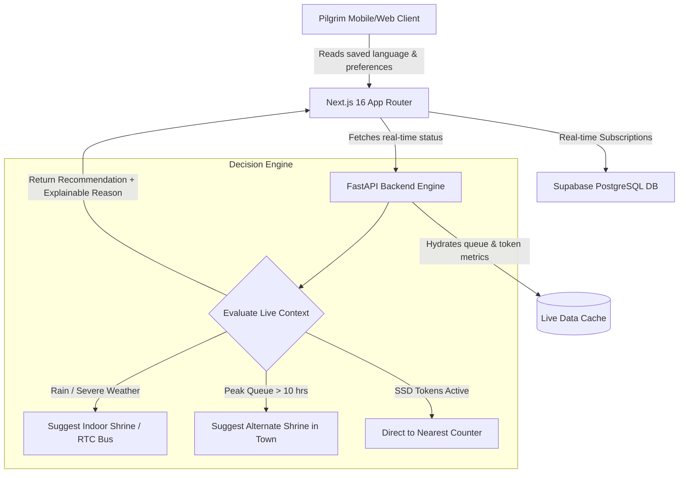

<div align="center">

# 🪔 Saarthi (సారథి)
### *Your Trusted Companion for a Smooth & Meaningful Journey in Tirupati & Tirumala*

[](https://nextjs.org/)
[](https://www.typescriptlang.org/)
[](https://fastapi.tiangolo.com/)
[](https://supabase.com/)
[](https://github.com/thatrasunil/saarthi)
[](LICENSE)

<br/>

> **Saarthi** is an intelligent, real-time pilgrim guidance platform designed to eliminate unpredictable queue delays, reduce travel anxiety, and provide transparent, data-driven recommendations for millions of devotees visiting Tirumala & Tirupati.

---

</div>

<br/>

## 🌐 Dynamic Multi-Language Support (తెలుగు & English)

Saarthi is built language-first for global and regional pilgrims:

```
          ┌───────────────────────────────────────────────┐
          │        🌐 Select Language (English / తెలుగు)   │
          └───────────────────────┬───────────────────────┘
                                  ▼
          ┌───────────────────────────────────────────────┐
          │    Dynamic App UI & Auto-Translation Engine   │
          └───────────────────────────────────────────────┘
```

- **Language-First Onboarding**: Select your preferred language before starting your yatra.
- **Native Typography**: Integrated **Noto Sans Telugu** Google Font for crisp, beautifully rendered regional script.
- **Zero-Cost Architecture**: Uses open-source React translation hooks + client-side translation widget with **0 paid API fees**.

---

## ⚡ Key Highlights & Features

| Feature | Description | Impact |
| :--- | :--- | :--- |
| **🤖 Saarthi Decision Engine** | Evaluates weather, live queue wait times, and token quotas to suggest the optimal next step. | Saves up to **8+ hours** in peak queues |
| **🎫 Live SSD Token Monitor** | Tracks offline Slotted Sarva Darshan token status across Vishnu Nivasam, Srinivasam & Bhudevi complexes. | Prevents wasted trips when quotas fill |
| **⏱️ Real-time Wait Times** | Live darshan queue duration updates for Sarva Darshan, SSD/DD, and ₹300 Special Entry. | Accurate decision-making |
| **🪔 Daily Spiritual Engine** | Day-specific themes, Annamayya sankeertanas, daily reflection quotes, and trivia. | Enriches spiritual experience |
| **🚨 Live Pilgrim Advisories** | Instant broadcast banner & full-screen emergency popups for rain, route closures, or festival rushes. | Enhances pilgrim safety |
| **🔒 Admin Control Center** | Dedicated `/saarthiadmin` panel for live queue adjustments, alert broadcasts, and token schedules. | Operational control |

---

## 🏗️ System Architecture



---

## 📱 Mobile-First Pilgrim Flow

```
Splash Screen ➔ 🌐 Language Selection ➔ Welcome ➔ Name ➔ Home Dashboard
                                                                │
         ┌───────────────────────┬──────────────────────────────┴─────────────────────────┐
         ▼                       ▼                                                         ▼
🎯 Decision Hero         🎫 SSD Token Status                                      🪔 Today's Companion
(Dynamic Advice)       (Live Counter Badges)                                    (Quotes & Daily Seva)
```

---

## 🛠️ Technology Stack

### **Frontend Stack**
- **Framework**: [Next.js 16](https://nextjs.org/) (App Router, Turbopack)
- **Language**: [TypeScript](https://www.typescriptlang.org/)
- **Styling**: Vanilla CSS Modules (Design tokens, modern glassmorphism, responsive UI)
- **Animations**: [Framer Motion](https://www.framer.com/motion/)
- **Icons**: [Lucide React](https://lucide.dev/)
- **Typography**: `Noto Sans Telugu`, `Plus Jakarta Sans`, `DM Serif Display`, `Inter`

### **Backend & Data Stack**
- **API Server**: [FastAPI](https://fastapi.tiangolo.com/) (Python 3.10+, Pydantic v2, Uvicorn)
- **Database**: [Supabase](https://supabase.com/) (PostgreSQL with Realtime WebSockets)
- **State & Storage**: Client `localStorage` preference persistence

---

## 🚀 Quick Start Guide

### Prerequisites
- **Node.js** >= 18.x
- **Python** >= 3.10
- **npm** or **pnpm**

### 1. Clone the Repository
```bash
git clone https://github.com/thatrasunil/saarthi.git
cd saarthi
```

### 2. Start Backend API
```bash
cd backend
python -m venv venv
# On Windows:
.\venv\Scripts\activate
# On Linux/macOS:
source venv/bin/activate

pip install -r requirements.txt
python -m uvicorn app.main:app --port 8000 --reload
```

### 3. Start Frontend Web App
```bash
# In the root directory (saarthi)
npm install
npm run dev
```

Open `http://localhost:3000` in your browser to launch Saarthi!

---

## 📂 Project Structure

```
saarthi/
├── src/
│   ├── app/
│   │   ├── onboarding/       # Language-first onboarding flow
│   │   ├── place/[id]/       # Detailed temple & place guide
│   │   ├── saarthiadmin/     # Admin briefing dashboard
│   │   ├── layout.tsx        # Root layout with font definitions
│   │   └── page.tsx          # Main home dashboard
│   ├── components/
│   │   ├── home/             # HomeHero, QuickChecklist, DailyContent, RecommendationCard
│   │   ├── BottomNav/        # Mobile bottom navigation bar
│   │   ├── SideMenu/         # Slide-out navigation drawer
│   │   ├── GoogleTranslate.tsx # Auto-translation provider
│   │   └── ClientLayout.tsx  # Root wrapper & location handler
│   └── lib/
│       ├── useLanguage.ts    # Language state & hook
│       └── supabase.ts       # Supabase client
├── backend/                  # FastAPI operational backend
│   └── app/
│       └── main.py           # REST endpoints & status engine
├── data/
│   └── status.json           # Live status fallback store
└── README.md
```

---

## 🤝 Contributing

Contributions are welcome! Please feel free to submit a Pull Request or open an Issue.

1. Fork the Project
2. Create your Feature Branch (`git checkout -b feature/AmazingFeature`)
3. Commit your Changes (`git commit -m 'Add some AmazingFeature'`)
4. Push to the Branch (`git push origin feature/AmazingFeature`)
5. Open a Pull Request

---

<div align="center">

**Made with ❤️ for Tirumala Pilgrims**

*Om Sri Venkateshaya Namaha* 🙏

</div>
