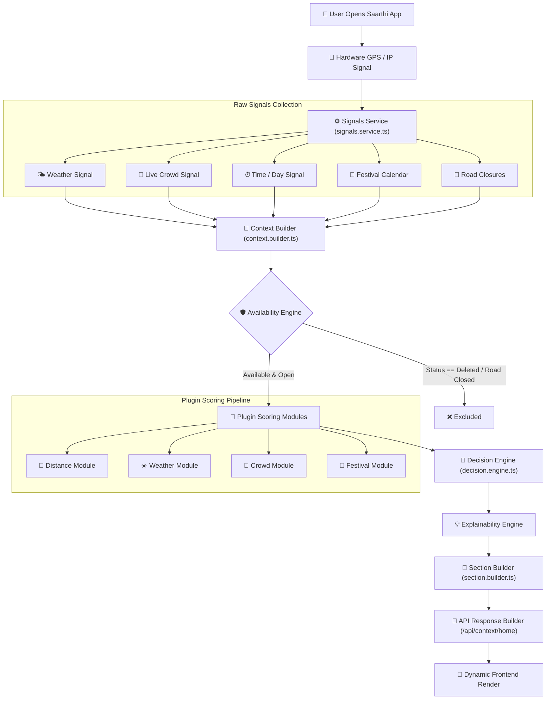

# Saarthi: Decision Engine & Hyperlocal Platform for Tirupati Pilgrims

Saarthi is a production-grade **Decision Engine and Destination Operating System for Tirupati pilgrims**. Instead of static travel itineraries, Saarthi calculates **real-time on-ground recommendations** based on live GPS coordinates, weather conditions, festival calendars, crowd density, road closures, and elderly accessibility.

> **Core Philosophy**: *Zero hardcoded sections. Zero guesswork. Every recommendation must be Available ✓ Open ✓ Safe ✓ Relevant ✓ Explainable ✓ Trusted ✓.*

---

## 📐 System Architecture Diagram



### High-Level Architecture Overview


### Hyperlocal Cab Pilot Mockup


---

## ⚡ Key Highlights & Recent Breakthroughs (v1.0.0)

### 🧠 1. Saarthi Decision Engine Architecture
- **Server-Driven Decision Pipeline**: `/api/context/home` executes a 7-stage scoring and filtering engine:
  - **Signal Collector Service**: Ingests real-time device hardware GPS, hour of day, weather, crowd density, and road status.
  - **Context Builder**: Computes derived traveler states (`isExtremeHeat`, `isRainy`, `isNearDarshanQueue`, `timeCategory`).
  - **Availability Engine**: Enforces strict safety rules (filters out deleted places, closed spots, and road-closed locations).
  - **Plugin Scoring Modules**: Pluggable scoring modules (`distance`, `weather`, `crowd`, `festival`, `parking`, `accessibility`, `rtc`).
  - **Explainability Engine**: Attributes every recommendation to authoritative source signals (e.g. *TTD Official Feed*, *IMD Weather Service*, *Real-time Geofence*).
  - **Section Builder & Response Formatter**: Generates contextual sections dynamically (`Quick to Reach`, `Beat the Heat`, `Spiritual Highlights`, `Rainy Day Alternatives`).

### 📍 2. Dynamic Realtime Sync & Tombstone Deletion
- **Zero Resurrections**: Deleting a place in Admin marks a tombstone (`status: 'deleted'`) in Supabase, preventing static fallback arrays from resurrecting deleted locations across client hooks (`useRealtimePlaces`) and server routes (`fetchLivePlaces`).
- **Dynamic Place Management**: Full `/admin/places` dashboard supporting coordinates editing (`lat`/`lng`), main cover photo uploads, gallery arrays, entry fees, timings, and verification badges.

### 🛰️ 3. Hardware-Level High Accuracy GPS
- **Tiered Location Resolution**: High-accuracy hardware GPS (`enableHighAccuracy: true`, `maximumAge: 0`) with automatic fallback to standard GPS, IP location, and Tirupati center.
- **Real-Time GPS Watcher**: Integrated `watchPosition` tracking that dynamically updates recommendations as pilgrims move across Tirupati and Tirumala.

### 🎛️ 4. Admin Decision Engine Simulation Sandbox (`/admin/decision-engine`)
- Live admin interactive simulator to test recommendation scores across custom scenarios (e.g. *Simulate 42°C Heatwave at 2:00 PM*, *Simulate Heavy Rain at Kapila Theertham*, *Simulate Brahmotsavam Festival*).
- Allows real-time tweaking of scoring weights and plugin parameters.

---

## 🛠️ Technology Stack

- **Framework**: Next.js 16 (App Router with Turbopack)
- **Language**: TypeScript (Strict Mode)
- **Styling**: Vanilla CSS Modules & Glassmorphism Aesthetics
- **Database & Sync**: Supabase (PostgreSQL with Realtime WebSockets & Tombstone Sync)
- **Decision Pipeline**: Server-Driven Decision Engine (`src/services/decision/`)
- **Map Visualizations**: Dynamic Vector Radar HUD & OpenStreetMap Embeds

---

## 📥 Getting Started

### 1. Clone & Install Dependencies
```bash
git clone https://github.com/thatrasunil/saarthi.git
cd saarthi
npm install
```

### 2. Configure Environment Variables
Create `.env.local` in the root directory:
```env
NEXT_PUBLIC_SUPABASE_URL=your_supabase_url
NEXT_PUBLIC_SUPABASE_ANON_KEY=your_supabase_anon_key
DATABASE_URL=your_database_url
```

### 3. Setup Database & Migrations
```bash
# Step 1: Run core schemas & Decision Engine tables
npx supabase migration up

# Step 2: Seed flagship places & festivals
node scripts/seed-flagship-data.mjs
```

### 4. Run Development Server
```bash
npm run dev
```
Open [http://localhost:3000](http://localhost:3000) to launch Saarthi.

---

## 🧪 Admin Dashboards

- **Decision Engine Sandbox**: `http://localhost:3000/admin/decision-engine`
- **Dynamic Places Management**: `http://localhost:3000/admin/places`
- **Pilgrim Feedback & Quality Signals**: `http://localhost:3000/admin/feedback`

---

## 📋 Common Commands

- `npm run dev` - Start development server
- `npx tsc --noEmit` - Run TypeScript compiler check
- `npm run build` - Build production bundle

---

**Repository**: [https://github.com/thatrasunil/saarthi/tree/V1](https://github.com/thatrasunil/saarthi/tree/V1)
