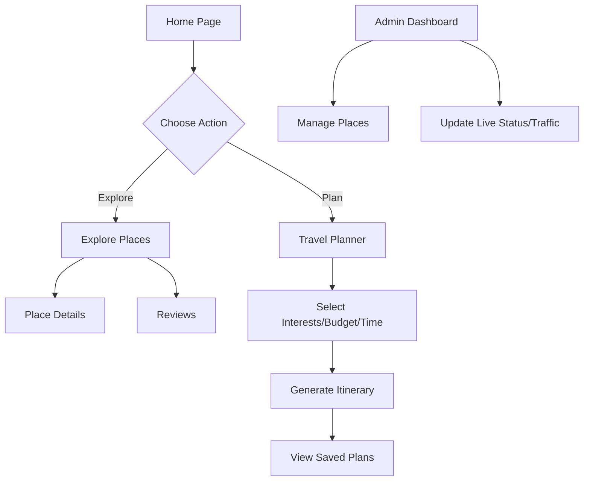

# Saarthi - Intelligent Tirupati Companion

Saarthi is a modern Next.js web application designed to help pilgrims and tourists plan trips, explore sacred and natural places, manage travel itineraries, and track live conditions seamlessly.

## Application Flow



## Architecture & Tech Stack

*   **Framework:** Next.js 16 (App Router)
*   **Styling:** CSS Modules & Tailwind CSS
*   **Database:** Supabase (PostgreSQL)
*   **CMS:** Sanity (structured content)
*   **Deployment:** Vercel

## Project Structure

```text
src/
├── app/          # Next.js App Router (pages, api routes)
├── components/   # Reusable UI components
├── constants/    # Application-wide constants
├── data/         # Static datasets
├── hooks/        # Custom React hooks
├── lib/          # Core utilities (env, logger, db)
├── services/     # Third-party integrations
├── store/        # Global state management
├── types/        # Shared TypeScript interfaces
└── utils/        # Helper functions
docs/             # Architectural and operational documentation
```

## Setup Instructions

1.  **Install dependencies:**
    ```bash
    npm install
    ```
2.  **Environment Variables:**
    Create a `.env.local` file in the root directory:
    ```env
    NEXT_PUBLIC_SUPABASE_URL=your_supabase_url
    NEXT_PUBLIC_SUPABASE_ANON_KEY=your_supabase_anon_key
    DATABASE_URL=your_database_url
    ```
3.  **Run the development server:**
    ```bash
    npm run dev
    ```
4.  Open [http://localhost:3000](http://localhost:3000) in your browser.

## Common Scripts

*   `npm run dev` - Start the development server
*   `npm run build` - Build the application for production
*   `npm run lint` - Run ESLint
*   `npm run type-check` - Run TypeScript compiler check
*   `npm run verify` - Run lint, type-check, and build
*   `npm run clean` - Remove node_modules and .next, then reinstall

## Contributing & Development

Ensure you run `npm run verify` before opening a pull request. We enforce strict separation of UI enhancements from architectural refactoring. Consult the `docs/` folder for in-depth guidelines on architecture and databases.
